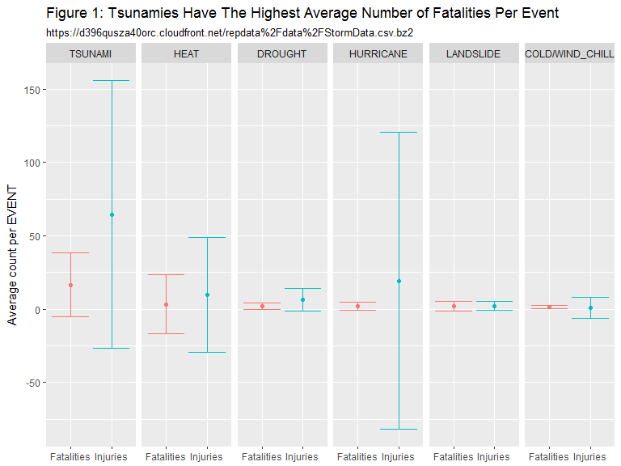
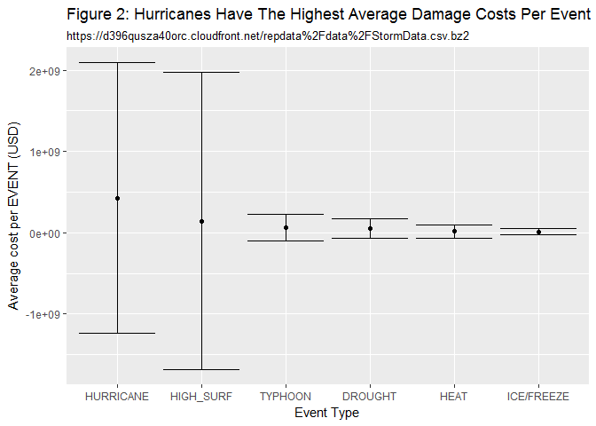

# Tsunamies and Hurricanes have the highest Health and Economic Consequences Respectively of Identified Storm Events
Diane Leigh  
May 27, 2017  


## Synopsis
Storms and other severe weather events can cause both public health and economic problems for communities and municipalities. Many severe events can result in fatalities, injuries, and property damage, and preventing such outcomes to the extent possible is a key concern. The U.S. National Oceanic and Atmospheric Administration's (NOAA) storm database tracks characteristics of major storms and weather events in the United States, including when and where they occur, as well as estimates of any fatalities, injuries, and property damage. Here we use this database to identify Tsunamies as the weather event With the highest average number of Fatalities per event and Hurricanes as the weather event with the highest average economic cost due to property and crop damage per event.

## Data Processing


```r
# download and read Storm Data file
fileUrl <- "https://d396qusza40orc.cloudfront.net/repdata%2Fdata%2FStormData.csv.bz2"
if(!file.exists("StormData.bz2"))download.file(fileUrl, "StormData.bz2")
if(!exists("StormData"))StormData <- read.csv("StormData.bz2")
```

###We have two questions to answer:  
1. Across the United States, which types of events (as indicated in the EVTYPE variable) are most harmful with respect to population health?  
2. Across the United States, which types of events have the greatest economic consequences?  

Two subsets were created with only the necessary columns of data to answer the two (pophealth, economics) questions.


```r
# Subset data to include only Reference number, EventData, Fatality, and Injury data to look at population health question. Include only data where either Fatality or Injury is not zero.
pophealth <- as.data.table(StormData[, c("REFNUM", "EVTYPE", "FATALITIES", "INJURIES")])
pophealth <- pophealth[FATALITIES>0|INJURIES>0]

# Subset data to include only Reference number, EventData,  Proper Damage and Crop Damage data to look at economics question.  Include only data where either PROPDMG or CROPDMG is not zero
economics <- as.data.table(StormData[, c("REFNUM","EVTYPE", "PROPDMG", "PROPDMGEXP", "CROPDMG", "CROPDMGEXP")])
economics <- economics[PROPDMG>0|CROPDMG>0]


# convert damage costs to dollars using multiplyers B = billions = 1E9, M = Millions = 1E6 and K = Thousands = 1E3. Then add property damage cost and crop damage cost.
x <-levels(economics$PROPDMGEXP)
y <- c(1, 1, 1, 1, 1, 1, 1, 1, 1, 1, 1, 1, 1, 1e9, 1e2, 1e2, 1e3, 1e6, 1e6)
df1 <- data.table(PROPDMGEXP=x, PRPMULT = y)
w <-levels(economics$CROPDMGEXP)
z <- c(1, 1, 1, 1, 1e9, 1e3, 1e3, 1e6, 1e6)
df2 <- data.table(CROPDMGEXP=w, CRPMULT = z)

setkey(df1, PROPDMGEXP)
setkey(economics, PROPDMGEXP)
economics <- economics[df1]
setkey(df2, CROPDMGEXP)
setkey(economics, CROPDMGEXP)
economics <- economics[df2]

economics <- economics[, ':='(prpcst = PROPDMG * PRPMULT)]
economics <- economics[, ':='(crpcst = CROPDMG * CRPMULT)]
economics <- economics[, ':='(cost = prpcst + crpcst)]
```

The EVTYPE column is not consistent with identifying an event (i.e. "COLD" and "COLD WAVE")  There are 48 EVTYPE identifiers in the STORM DATA PREPARATION provided by the National Weather Service (https://d396qusza40orc.cloudfront.net/repdata%2Fpeer2_doc%2Fpd01016005curr.pdf),  
and 985 unique EVTYPE identifiers in the Storm Data. This next two code chunks (population health, economic) create an EVENT column containing a cleaned up version of the EVTYPE column in the subsetted data to match the events in the file supplied by the National Weather Service.


```r
pophealth <- mutate_each(pophealth, funs(toupper))
# Get and combine unique event types in the subsetted data
popev <- data.table(unique(pophealth$EVTYPE, names("EVTYPE")))
names(popev) <- "EVTYPE"
popev <- mutate(popev, EVENT = "")

# Identify EVENTs which correspond to multiple EVTYPEs

for(i in 1:nrow(popev)){
       if(grepl(".*TORN.*|.*FUNNEL.*", popev$EVTYPE[i])){
            popev$EVENT[i] <- "TORNADO"
       }
     else if(grepl(".*HURRICANE.*", popev$EVTYPE[i])){
            popev$EVENT[i] <- "HURRICANE"
     }
     else if(grepl(".*AVALAN.*", popev$EVTYPE[i])){
            popev$EVENT[i] <- "AVALANCHE"
     }
     else if(grepl(".*BLIZ.*", popev$EVTYPE[i])){
            popev$EVENT[i] <- "BLIZZARD"
     }
     else if(grepl(".*SNOW.*", popev$EVTYPE[i])){
            popev$EVENT[i] <- "HEAVY_SNOW"
     }
     else if(grepl(".*COASTAL.*FLOOD.*|.*TIDAL.*FLOOD.*|.*EROSION.*", popev$EVTYPE[i])){
            popev$EVENT[i] <- "COASTAL_FLOOD"
     }
     
     else if(grepl(".*FLOOD.*|.*RISING.*|.*WATER.*|.*FLD.*", popev$EVTYPE[i])){
            popev$EVENT[i] <- "FLOOD"
     }
     else if(grepl(".*COLD.*|.*CHILL.*|.*LOW TEMP.*|.*HYPOTHERM.*", popev$EVTYPE[i])){
            popev$EVENT[i] <- "COLD/WIND_CHILL"
     }
     else if(grepl(".*DROUGHT.*", popev$EVTYPE[i])){
            popev$EVENT[i] <- "DROUGHT"
     }
     else if(grepl(".*HEAT.*|.*HYPERTHERM.*|.*WARM.*", popev$EVTYPE[i])){
            popev$EVENT[i] <- "HEAT"
     }
     else if(grepl(".*COASTAL.*STORM.*", popev$EVTYPE[i])){
            popev$EVENT[i] <- "COASTAL_STORM"
     }
     else if(grepl(".*LIG.*", popev$EVTYPE[i])){
            popev$EVENT[i] <- "LIGHTNING"
     }
     else if(grepl(".*MARINE.*THUND.*", popev$EVTYPE[i])){
            popev$EVENT[i] <- "MARINE_THUNDERSTORM_WIND"
     }
     else if(grepl(".*THUND.*", popev$EVTYPE[i])){
            popev$EVENT[i] <- "THUNDERSTORM WIND"
     }
     else if(grepl(".*DRY.*|.*DUST.*", popev$EVTYPE[i])){
            popev$EVENT[i] <- "DUST_STORM"
     }
     else if(grepl(".*SLIDE.*", popev$EVTYPE[i])){
            popev$EVENT[i] <- "LANDSLIDE"
     }
     else if(grepl(".*RIP.*", popev$EVTYPE[i])){
            popev$EVENT[i] <- "RIP_CURRENT"
     }
     else if(grepl(".*FREEZE.*|.*FROST.*", popev$EVTYPE[i])){
            popev$EVENT[i] <- "ICE/FREEZE"
     }
     else if(grepl(".*FREEZING.*|.*GLAZE.*|.*ICE STORM.*", popev$EVTYPE[i])){
            popev$EVENT[i] <- "ICE_STORM"
     }
     else if(grepl(".*RAIN.*|.*DOWNBURST.*", popev$EVTYPE[i])){
            popev$EVENT[i] <- "HEAVY_RAIN"
     }
     else if(grepl(".*SEA.*|.*SURF.*|.*SWELLS.*|.*WAVE.*|.*HIGH.*TIDE.*|.*SURGE.*", popev$EVTYPE[i])){
            popev$EVENT[i] <- "HIGH_SURF"
     }
     else if(grepl(".*LOW.*TIDE.*", popev$EVTYPE[i])){
            popev$EVENT[i] <- "LOW_TIDE"
     }
     else if(grepl(".*ROAD.*|.*ICE.*", popev$EVTYPE[i])){
            popev$EVENT[i] <- "ICY_ROAD"
     }
     else if(grepl(".*MARINE.*", popev$EVTYPE[i])){
            popev$EVENT[i] <- "MARINE_HIGH_WIND"
     }
     else if(grepl(".*TROPICAL.*|.*TSTM.*", popev$EVTYPE[i])){
            popev$EVENT[i] <- "TROPICAL_STORM"
     }
     else if(grepl(".*WIND.*", popev$EVTYPE[i])){
            popev$EVENT[i] <- "HIGH_WIND"
     }
     else if(grepl(".*FIRE.*", popev$EVTYPE[i])){
            popev$EVENT[i] <- "WILDFIRE"
     }
     else if(grepl(".*WINTER.*|.*WINTRY.*", popev$EVTYPE[i])){
            popev$EVENT[i] <- "WINTER_STORM"
     }
     else if(grepl(".*HAIL.*", popev$EVTYPE[i])){
            popev$EVENT[i] <- "HAIL"
     }
     else if(grepl(".*FOG.*", popev$EVTYPE[i])){
            popev$EVENT[i] <- "DENSE_FOG"
     }
     else if(grepl(".*TSU.*", popev$EVTYPE[i])){
            popev$EVENT[i] <- "TSUNAMI"
     }
     else if(grepl(".*TYPH.*", popev$EVTYPE[i])){
            popev$EVENT[i] <- "TYPHOON"
     }
     else {popev$EVENT[i] <- "OTHER"}
}

#Create column in subsetted data to group EVTYPE by EVENT
pophealth <- as.data.table(pophealth)

pophealth <- merge(pophealth, popev, all.x = TRUE)

pophealth$EVENT <- as.factor(pophealth$EVENT)
pophealth$EVTYPE <- as.factor(pophealth$EVTYPE)
pophealth$FATALITIES <- as.numeric(pophealth$FATALITIES)
pophealth$INJURIES <- as.numeric(pophealth$INJURIES)
```


```r
economics <- mutate_each(economics, funs(toupper))
# Get and combine unique event types in the subsetted data
ecoev <- data.table(unique(economics$EVTYPE, names("EVTYPE")))
names(ecoev) <- "EVTYPE"
ecoev <- mutate(ecoev, EVENT = "")

# Identify EVENTs which correspond to multiple EVTYPEs

for(i in 1:nrow(ecoev)){
       if(grepl(".*TORN.*|.*FUNNEL.*", ecoev$EVTYPE[i])){
            ecoev$EVENT[i] <- "TORNADO"
       }
     else if(grepl(".*HURRICANE.*", ecoev$EVTYPE[i])){
            ecoev$EVENT[i] <- "HURRICANE"
     }
     else if(grepl(".*AVALAN.*", ecoev$EVTYPE[i])){
            ecoev$EVENT[i] <- "AVALANCHE"
     }
     else if(grepl(".*BLIZ.*", ecoev$EVTYPE[i])){
            ecoev$EVENT[i] <- "BLIZZARD"
     }
     else if(grepl(".*SNOW.*", ecoev$EVTYPE[i])){
            ecoev$EVENT[i] <- "HEAVY_SNOW"
     }
     else if(grepl(".*COASTAL.*FLOOD.*|.*TIDAL.*FLOOD.*|.*EROSION.*", ecoev$EVTYPE[i])){
            ecoev$EVENT[i] <- "COASTAL_FLOOD"
     }
    
     else if(grepl(".*FLOOD.*|.*RISING.*|.*WATER.*|.*FLD.*", ecoev$EVTYPE[i])){
            ecoev$EVENT[i] <- "FLOOD"
     }
     else if(grepl(".*COLD.*|.*CHILL.*|.*LOW TEMP.*|.*HYPOTHERM.*", ecoev$EVTYPE[i])){
            ecoev$EVENT[i] <- "COLD/WIND_CHILL"
     }
     else if(grepl(".*DROUGHT.*", ecoev$EVTYPE[i])){
            ecoev$EVENT[i] <- "DROUGHT"
     }
     else if(grepl(".*HEAT.*|.*HYPERTHERM.*|.*WARM.*", ecoev$EVTYPE[i])){
            ecoev$EVENT[i] <- "HEAT"
     }
     else if(grepl(".*COASTAL.*STORM.*", ecoev$EVTYPE[i])){
            ecoev$EVENT[i] <- "COASTAL_STORM"
     }
     else if(grepl(".*LIG.*", ecoev$EVTYPE[i])){
            ecoev$EVENT[i] <- "LIGHTNING"
     }
     else if(grepl(".*MARINE.*THUND.*", ecoev$EVTYPE[i])){
            ecoev$EVENT[i] <- "MARINE_THUNDERSTORM_WIND"
     }
     else if(grepl(".*THUND.*", ecoev$EVTYPE[i])){
            ecoev$EVENT[i] <- "THUNDERSTORM WIND"
     }
     else if(grepl(".*DRY.*|.*DUST.*", ecoev$EVTYPE[i])){
            ecoev$EVENT[i] <- "DUST_STORM"
     }
     else if(grepl(".*SLIDE.*", ecoev$EVTYPE[i])){
            ecoev$EVENT[i] <- "LANDSLIDE"
     }
     else if(grepl(".*RIP.*", ecoev$EVTYPE[i])){
            ecoev$EVENT[i] <- "RIP_CURRENT"
     }
     else if(grepl(".*FREEZE.*|.*FROST.*", ecoev$EVTYPE[i])){
            ecoev$EVENT[i] <- "ICE/FREEZE"
     }
     else if(grepl(".*FREEZING.*|.*GLAZE.*|.*ICE STORM.*", ecoev$EVTYPE[i])){
            ecoev$EVENT[i] <- "ICE_STORM"
     }
     else if(grepl(".*RAIN.*|.*DOWNBURST.*", ecoev$EVTYPE[i])){
            ecoev$EVENT[i] <- "HEAVY_RAIN"
     }
     else if(grepl(".*SEA.*|.*SURF.*|.*SWELLS.*|.*WAVE.*|.*HIGH.*TIDE.*|.*SURGE.*", ecoev$EVTYPE[i])){
            ecoev$EVENT[i] <- "HIGH_SURF"
     }
     else if(grepl(".*LOW.*TIDE.*", ecoev$EVTYPE[i])){
            ecoev$EVENT[i] <- "LOW_TIDE"
     }
     else if(grepl(".*ROAD.*|.*ICE.*", ecoev$EVTYPE[i])){
            ecoev$EVENT[i] <- "ICY_ROAD"
     }
     else if(grepl(".*MARINE.*", ecoev$EVTYPE[i])){
            ecoev$EVENT[i] <- "MARINE_HIGH_WIND"
     }
     else if(grepl(".*TROPICAL.*|.*TSTM.*", ecoev$EVTYPE[i])){
            ecoev$EVENT[i] <- "TROPICAL_STORM"
     }
     else if(grepl(".*WIND.*", ecoev$EVTYPE[i])){
            ecoev$EVENT[i] <- "HIGH_WIND"
     }
     else if(grepl(".*FIRE.*", ecoev$EVTYPE[i])){
            ecoev$EVENT[i] <- "WILDFIRE"
     }
     else if(grepl(".*WINTER.*|.*WINTRY.*", ecoev$EVTYPE[i])){
            ecoev$EVENT[i] <- "WINTER_STORM"
     }
     else if(grepl(".*HAIL.*", ecoev$EVTYPE[i])){
            ecoev$EVENT[i] <- "HAIL"
     }
     else if(grepl(".*FOG.*", ecoev$EVTYPE[i])){
            ecoev$EVENT[i] <- "DENSE_FOG"
     }
     else if(grepl(".*TSU.*", ecoev$EVTYPE[i])){
            ecoev$EVENT[i] <- "TSUNAMI"
     }
     else if(grepl(".*TYPH.*", ecoev$EVTYPE[i])){
            ecoev$EVENT[i] <- "TYPHOON"
     }
     else {ecoev$EVENT[i] <- "OTHER"}
}

#Create column in subsetted data to group EVTYPE by EVENT
economics <- as.data.table(economics)

economics <- merge(economics, ecoev, all.x = TRUE)

economics$EVENT <- as.factor(economics$EVENT)
economics$EVTYPE <- as.factor(economics$EVTYPE)
economics$cost <- as.numeric(economics$cost)
economics$prpcst <- as.numeric(economics$prpcst)
economics$crpcst <- as.numeric(economics$crpcst)
```

## Results

###Question #1: Across the United States, which types of events (as indicated in the EVENT variable) are most harmful with respect to population health?

I have interpreted this to mean on a per event basis, so Figure 1 presents the average number of Fatalities and Injuries reported for each of the top 6 event types. I did not combine the fatality and injury data, as more information on the severity of injury would be needed to weight the injuries relative to a fatality. Table 1 presents the Total, average and standard deviation for both fatalities and injuries. Table 1 is sorted by Total fatalities. It is worth noting that identifying the most harmful event types by average (Figure 1) gives a different result than if the totals had been used (first 6 rows of TABLE 1)

```r
# Calculate Total, mean and standard deviation for the number of Fatalities and injuries reported for each event type.
sumpophealth <- pophealth[, .(Total_Fatalities = sum(FATALITIES),
                          Average_Fatalities = mean(FATALITIES), 
                          STD_Fat = sd(FATALITIES),
                          Total_Injuries = sum(INJURIES), 
                          Average_Injuries = mean(INJURIES),
                          STD_Inj = sd(INJURIES)),
                          by = EVENT]

# Find the top 6 event types with respect to average number of fatalities reported.

sumpophealth <- sumpophealth[order(-sumpophealth$Average_Fatalities),]
top6avgfat <- sumpophealth[1:6, ]

# Reorder based on total fatalities 
sumpophealth <- sumpophealth[order(-sumpophealth$Total_Fatalities),]

xtpop <- xtable(sumpophealth, caption = "Table 1: Total and average/incident Fatalities and Injuries - Sorted by total Fatalities", align = "cccccccc")

# Melt data for plotting
top6avgfat.m1 = melt(top6avgfat, id.vars = "EVENT", measure = patterns("^Total_", "^Average_", "^STD_"), value.name = c("Total", "Average", "STD"))
top6avgfat.m1 <- top6avgfat.m1[variable == 1, variable := "Fatalities"]
top6avgfat.m1 <- top6avgfat.m1[variable == 2, variable := "Injuries"]

top6avgfat.m1$EVENT <- as.character(top6avgfat.m1$EVENT)
top6avgfat.m1$EVENT <- factor(top6avgfat.m1$EVENT, levels = unique(top6avgfat.m1$EVENT))

g <- ggplot(top6avgfat.m1, aes(variable, Average, ymin = Average - STD, ymax = Average + STD, color = variable)) + geom_point() + geom_errorbar() + facet_wrap("EVENT", nrow = 1, ncol = 6) + theme(legend.position="none") + labs(x = NULL, y = "Average count per EVENT", title = "Figure 1: Tsunamies Have The Highest Average Number of Fatalities Per Event", subtitle = "https://d396qusza40orc.cloudfront.net/repdata%2Fdata%2FStormData.csv.bz2")

g
```

<!-- -->

```r
print(xtpop, type = "html", include.rownames = FALSE, caption.placement = "top")
```

<!-- html table generated in R 3.4.0 by xtable 1.8-2 package -->
<!-- Wed Jun 07 04:31:09 2017 -->
<table border=1>
<caption align="top"> Table 1: Total and average/incident Fatalities and Injuries - Sorted by total Fatalities </caption>
<tr> <th> EVENT </th> <th> Total_Fatalities </th> <th> Average_Fatalities </th> <th> STD_Fat </th> <th> Total_Injuries </th> <th> Average_Injuries </th> <th> STD_Inj </th>  </tr>
  <tr> <td align="center"> TORNADO </td> <td align="center"> 5661.00 </td> <td align="center"> 0.71 </td> <td align="center"> 3.86 </td> <td align="center"> 91410.00 </td> <td align="center"> 11.52 </td> <td align="center"> 46.26 </td> </tr>
  <tr> <td align="center"> HEAT </td> <td align="center"> 3173.00 </td> <td align="center"> 3.36 </td> <td align="center"> 20.06 </td> <td align="center"> 9228.00 </td> <td align="center"> 9.77 </td> <td align="center"> 39.35 </td> </tr>
  <tr> <td align="center"> FLOOD </td> <td align="center"> 1554.00 </td> <td align="center"> 1.07 </td> <td align="center"> 1.38 </td> <td align="center"> 8704.00 </td> <td align="center"> 5.99 </td> <td align="center"> 46.16 </td> </tr>
  <tr> <td align="center"> LIGHTNING </td> <td align="center"> 817.00 </td> <td align="center"> 0.25 </td> <td align="center"> 0.48 </td> <td align="center"> 5232.00 </td> <td align="center"> 1.58 </td> <td align="center"> 2.40 </td> </tr>
  <tr> <td align="center"> RIP_CURRENT </td> <td align="center"> 577.00 </td> <td align="center"> 0.90 </td> <td align="center"> 0.60 </td> <td align="center"> 529.00 </td> <td align="center"> 0.83 </td> <td align="center"> 2.50 </td> </tr>
  <tr> <td align="center"> TROPICAL_STORM </td> <td align="center"> 576.00 </td> <td align="center"> 0.19 </td> <td align="center"> 0.68 </td> <td align="center"> 7440.00 </td> <td align="center"> 2.48 </td> <td align="center"> 5.61 </td> </tr>
  <tr> <td align="center"> COLD/WIND_CHILL </td> <td align="center"> 468.00 </td> <td align="center"> 1.30 </td> <td align="center"> 1.01 </td> <td align="center"> 325.00 </td> <td align="center"> 0.91 </td> <td align="center"> 7.28 </td> </tr>
  <tr> <td align="center"> HIGH_WIND </td> <td align="center"> 426.00 </td> <td align="center"> 0.47 </td> <td align="center"> 0.78 </td> <td align="center"> 1862.00 </td> <td align="center"> 2.04 </td> <td align="center"> 4.71 </td> </tr>
  <tr> <td align="center"> WINTER_STORM </td> <td align="center"> 278.00 </td> <td align="center"> 0.91 </td> <td align="center"> 1.17 </td> <td align="center"> 1953.00 </td> <td align="center"> 6.36 </td> <td align="center"> 16.10 </td> </tr>
  <tr> <td align="center"> AVALANCHE </td> <td align="center"> 225.00 </td> <td align="center"> 0.93 </td> <td align="center"> 0.80 </td> <td align="center"> 171.00 </td> <td align="center"> 0.71 </td> <td align="center"> 1.24 </td> </tr>
  <tr> <td align="center"> HIGH_SURF </td> <td align="center"> 210.00 </td> <td align="center"> 1.12 </td> <td align="center"> 1.52 </td> <td align="center"> 324.00 </td> <td align="center"> 1.72 </td> <td align="center"> 4.98 </td> </tr>
  <tr> <td align="center"> THUNDERSTORM WIND </td> <td align="center"> 201.00 </td> <td align="center"> 0.19 </td> <td align="center"> 0.55 </td> <td align="center"> 2452.00 </td> <td align="center"> 2.33 </td> <td align="center"> 4.79 </td> </tr>
  <tr> <td align="center"> HEAVY_SNOW </td> <td align="center"> 169.00 </td> <td align="center"> 0.74 </td> <td align="center"> 1.33 </td> <td align="center"> 1165.00 </td> <td align="center"> 5.11 </td> <td align="center"> 14.90 </td> </tr>
  <tr> <td align="center"> HURRICANE </td> <td align="center"> 135.00 </td> <td align="center"> 1.96 </td> <td align="center"> 2.86 </td> <td align="center"> 1328.00 </td> <td align="center"> 19.25 </td> <td align="center"> 101.09 </td> </tr>
  <tr> <td align="center"> ICE_STORM </td> <td align="center"> 106.00 </td> <td align="center"> 0.85 </td> <td align="center"> 1.15 </td> <td align="center"> 2244.00 </td> <td align="center"> 18.10 </td> <td align="center"> 140.69 </td> </tr>
  <tr> <td align="center"> BLIZZARD </td> <td align="center"> 101.00 </td> <td align="center"> 1.17 </td> <td align="center"> 1.42 </td> <td align="center"> 805.00 </td> <td align="center"> 9.36 </td> <td align="center"> 44.59 </td> </tr>
  <tr> <td align="center"> HEAVY_RAIN </td> <td align="center"> 101.00 </td> <td align="center"> 0.81 </td> <td align="center"> 1.81 </td> <td align="center"> 280.00 </td> <td align="center"> 2.24 </td> <td align="center"> 4.53 </td> </tr>
  <tr> <td align="center"> WILDFIRE </td> <td align="center"> 90.00 </td> <td align="center"> 0.27 </td> <td align="center"> 1.22 </td> <td align="center"> 1608.00 </td> <td align="center"> 4.83 </td> <td align="center"> 11.44 </td> </tr>
  <tr> <td align="center"> DENSE_FOG </td> <td align="center"> 80.00 </td> <td align="center"> 0.63 </td> <td align="center"> 1.26 </td> <td align="center"> 1076.00 </td> <td align="center"> 8.54 </td> <td align="center"> 12.90 </td> </tr>
  <tr> <td align="center"> LANDSLIDE </td> <td align="center"> 44.00 </td> <td align="center"> 1.83 </td> <td align="center"> 3.37 </td> <td align="center"> 55.00 </td> <td align="center"> 2.29 </td> <td align="center"> 2.97 </td> </tr>
  <tr> <td align="center"> TSUNAMI </td> <td align="center"> 33.00 </td> <td align="center"> 16.50 </td> <td align="center"> 21.92 </td> <td align="center"> 129.00 </td> <td align="center"> 64.50 </td> <td align="center"> 91.22 </td> </tr>
  <tr> <td align="center"> MARINE_HIGH_WIND </td> <td align="center"> 32.00 </td> <td align="center"> 1.23 </td> <td align="center"> 1.39 </td> <td align="center"> 38.00 </td> <td align="center"> 1.46 </td> <td align="center"> 2.02 </td> </tr>
  <tr> <td align="center"> DUST_STORM </td> <td align="center"> 27.00 </td> <td align="center"> 0.36 </td> <td align="center"> 1.26 </td> <td align="center"> 512.00 </td> <td align="center"> 6.83 </td> <td align="center"> 8.43 </td> </tr>
  <tr> <td align="center"> HAIL </td> <td align="center"> 15.00 </td> <td align="center"> 0.05 </td> <td align="center"> 0.31 </td> <td align="center"> 1371.00 </td> <td align="center"> 4.71 </td> <td align="center"> 11.20 </td> </tr>
  <tr> <td align="center"> ICY_ROAD </td> <td align="center"> 13.00 </td> <td align="center"> 0.46 </td> <td align="center"> 0.69 </td> <td align="center"> 193.00 </td> <td align="center"> 6.89 </td> <td align="center"> 14.34 </td> </tr>
  <tr> <td align="center"> MARINE_THUNDERSTORM_WIND </td> <td align="center"> 10.00 </td> <td align="center"> 0.91 </td> <td align="center"> 0.70 </td> <td align="center"> 26.00 </td> <td align="center"> 2.36 </td> <td align="center"> 3.70 </td> </tr>
  <tr> <td align="center"> DROUGHT </td> <td align="center"> 6.00 </td> <td align="center"> 2.00 </td> <td align="center"> 2.00 </td> <td align="center"> 19.00 </td> <td align="center"> 6.33 </td> <td align="center"> 7.77 </td> </tr>
  <tr> <td align="center"> COASTAL_FLOOD </td> <td align="center"> 6.00 </td> <td align="center"> 0.75 </td> <td align="center"> 0.89 </td> <td align="center"> 8.00 </td> <td align="center"> 1.00 </td> <td align="center"> 1.69 </td> </tr>
  <tr> <td align="center"> OTHER </td> <td align="center"> 5.00 </td> <td align="center"> 0.50 </td> <td align="center"> 0.71 </td> <td align="center"> 31.00 </td> <td align="center"> 3.10 </td> <td align="center"> 4.63 </td> </tr>
  <tr> <td align="center"> COASTAL_STORM </td> <td align="center"> 4.00 </td> <td align="center"> 0.80 </td> <td align="center"> 0.45 </td> <td align="center"> 2.00 </td> <td align="center"> 0.40 </td> <td align="center"> 0.55 </td> </tr>
  <tr> <td align="center"> ICE/FREEZE </td> <td align="center"> 2.00 </td> <td align="center"> 1.00 </td> <td align="center"> 0.00 </td> <td align="center"> 3.00 </td> <td align="center"> 1.50 </td> <td align="center"> 2.12 </td> </tr>
  <tr> <td align="center"> TYPHOON </td> <td align="center"> 0.00 </td> <td align="center"> 0.00 </td> <td align="center"> 0.00 </td> <td align="center"> 5.00 </td> <td align="center"> 2.50 </td> <td align="center"> 0.71 </td> </tr>
   </table>

###Question #2:Across the United States, which types of events (as indicated in the EVENT variable) have the greatest economic consequences? 

I have interpreted this to mean on a per event basis, so Figure 2 presents the average total cost (property + crop damage) reported for each of the top 6 event types.  Table 2 presents the Total, average and standard deviation for Total, Property and Crop Damage. Table 1 is sorted by Total Damage Cost. It is worth noting that identifying the most costly event types by average (Figure 2) gives a different result than if the totals had been used (first 6 rows of TABLE 2)


```r
# Calculate Total, mean and standard deviation for the damage cost reported for Total, property and crop damage for each event type.
sumeconomics <- economics[, .(Total_Cost = sum(cost),
                          Average_Cost = mean(cost), 
                          STD_Cost = sd(cost),Total_prop = sum(prpcst),
                          Average_prop = mean(prpcst), 
                          STD_prop = sd(prpcst),Total_crop = sum(crpcst),
                          Average_crop = mean(crpcst), 
                          STD_crop = sd(crpcst)),
                          by = EVENT]

# Find the top 6 event types with respect to average cost for total damage.
sumeconomics <- sumeconomics[order(-sumeconomics$Average_Cost),]
top6avgcost <- sumeconomics[1:6, ]

# Reorder based on total cost 
sumeconomics <- sumeconomics[order(-sumeconomics$Total_Cost),]
top6cost <- sumeconomics[1:6, "EVENT"]

xteco <- xtable(sumeconomics, caption = "Table 2: Total and average/incident Cost is USD - Sorted by total Cost", digits=-1, align = "ccccccccccc")


top6avgcost$EVENT <- as.character(top6avgcost$EVENT)
top6avgcost$EVENT <- factor(top6avgcost$EVENT, levels = unique(top6avgcost$EVENT))

g <- ggplot(top6avgcost, aes(EVENT, Average_Cost, ymin = Average_Cost - STD_Cost, ymax = Average_Cost + STD_Cost)) + geom_point() + geom_errorbar() + labs(x = "Event Type", y = "Average cost per EVENT (USD)", title = "Figure 2: Hurricanes Have The Highest Average Damage Costs Per Event", subtitle = "https://d396qusza40orc.cloudfront.net/repdata%2Fdata%2FStormData.csv.bz2")

g
```

<!-- -->

```r
print(xteco, type = "html", include.rownames = FALSE, caption.placement = "top")
```

<!-- html table generated in R 3.4.0 by xtable 1.8-2 package -->
<!-- Wed Jun 07 04:31:10 2017 -->
<table border=1>
<caption align="top"> Table 2: Total and average/incident Cost is USD - Sorted by total Cost </caption>
<tr> <th> EVENT </th> <th> Total_Cost </th> <th> Average_Cost </th> <th> STD_Cost </th> <th> Total_prop </th> <th> Average_prop </th> <th> STD_prop </th> <th> Total_crop </th> <th> Average_crop </th> <th> STD_crop </th>  </tr>
  <tr> <td align="center"> FLOOD </td> <td align="center"> 1.8E+11 </td> <td align="center"> 5.5E+06 </td> <td align="center"> 6.4E+08 </td> <td align="center"> 1.7E+11 </td> <td align="center"> 5.1E+06 </td> <td align="center"> 6.4E+08 </td> <td align="center"> 1.2E+10 </td> <td align="center"> 3.8E+05 </td> <td align="center"> 2.8E+07 </td> </tr>
  <tr> <td align="center"> HURRICANE </td> <td align="center"> 9.0E+10 </td> <td align="center"> 4.2E+08 </td> <td align="center"> 1.7E+09 </td> <td align="center"> 8.5E+10 </td> <td align="center"> 4.0E+08 </td> <td align="center"> 1.6E+09 </td> <td align="center"> 5.5E+09 </td> <td align="center"> 2.6E+07 </td> <td align="center"> 1.2E+08 </td> </tr>
  <tr> <td align="center"> TORNADO </td> <td align="center"> 5.9E+10 </td> <td align="center"> 1.5E+06 </td> <td align="center"> 2.2E+07 </td> <td align="center"> 5.9E+10 </td> <td align="center"> 1.5E+06 </td> <td align="center"> 2.2E+07 </td> <td align="center"> 4.2E+08 </td> <td align="center"> 1.1E+04 </td> <td align="center"> 5.2E+05 </td> </tr>
  <tr> <td align="center"> HIGH_SURF </td> <td align="center"> 4.8E+10 </td> <td align="center"> 1.4E+08 </td> <td align="center"> 1.8E+09 </td> <td align="center"> 4.8E+10 </td> <td align="center"> 1.4E+08 </td> <td align="center"> 1.8E+09 </td> <td align="center"> 8.6E+05 </td> <td align="center"> 2.6E+03 </td> <td align="center"> 4.1E+04 </td> </tr>
  <tr> <td align="center"> HAIL </td> <td align="center"> 1.9E+10 </td> <td align="center"> 7.3E+05 </td> <td align="center"> 1.5E+07 </td> <td align="center"> 1.6E+10 </td> <td align="center"> 6.1E+05 </td> <td align="center"> 1.5E+07 </td> <td align="center"> 3.0E+09 </td> <td align="center"> 1.2E+05 </td> <td align="center"> 1.3E+06 </td> </tr>
  <tr> <td align="center"> DROUGHT </td> <td align="center"> 1.5E+10 </td> <td align="center"> 5.4E+07 </td> <td align="center"> 1.2E+08 </td> <td align="center"> 1.0E+09 </td> <td align="center"> 3.8E+06 </td> <td align="center"> 3.9E+07 </td> <td align="center"> 1.4E+10 </td> <td align="center"> 5.1E+07 </td> <td align="center"> 1.2E+08 </td> </tr>
  <tr> <td align="center"> TROPICAL_STORM </td> <td align="center"> 1.4E+10 </td> <td align="center"> 2.2E+05 </td> <td align="center"> 2.1E+07 </td> <td align="center"> 1.2E+10 </td> <td align="center"> 2.0E+05 </td> <td align="center"> 2.1E+07 </td> <td align="center"> 1.3E+09 </td> <td align="center"> 2.1E+04 </td> <td align="center"> 1.0E+06 </td> </tr>
  <tr> <td align="center"> ICE_STORM </td> <td align="center"> 9.0E+09 </td> <td align="center"> 1.2E+07 </td> <td align="center"> 1.9E+08 </td> <td align="center"> 4.0E+09 </td> <td align="center"> 5.4E+06 </td> <td align="center"> 2.6E+07 </td> <td align="center"> 5.0E+09 </td> <td align="center"> 6.9E+06 </td> <td align="center"> 1.9E+08 </td> </tr>
  <tr> <td align="center"> WILDFIRE </td> <td align="center"> 8.9E+09 </td> <td align="center"> 8.0E+06 </td> <td align="center"> 6.8E+07 </td> <td align="center"> 8.5E+09 </td> <td align="center"> 7.6E+06 </td> <td align="center"> 6.7E+07 </td> <td align="center"> 4.0E+08 </td> <td align="center"> 3.6E+05 </td> <td align="center"> 4.6E+06 </td> </tr>
  <tr> <td align="center"> THUNDERSTORM WIND </td> <td align="center"> 7.1E+09 </td> <td align="center"> 1.3E+05 </td> <td align="center"> 6.9E+06 </td> <td align="center"> 6.4E+09 </td> <td align="center"> 1.2E+05 </td> <td align="center"> 6.8E+06 </td> <td align="center"> 6.5E+08 </td> <td align="center"> 1.2E+04 </td> <td align="center"> 5.0E+05 </td> </tr>
  <tr> <td align="center"> HIGH_WIND </td> <td align="center"> 6.9E+09 </td> <td align="center"> 7.3E+05 </td> <td align="center"> 2.0E+07 </td> <td align="center"> 6.1E+09 </td> <td align="center"> 6.5E+05 </td> <td align="center"> 1.9E+07 </td> <td align="center"> 7.6E+08 </td> <td align="center"> 8.0E+04 </td> <td align="center"> 2.3E+06 </td> </tr>
  <tr> <td align="center"> WINTER_STORM </td> <td align="center"> 6.8E+09 </td> <td align="center"> 3.6E+06 </td> <td align="center"> 1.2E+08 </td> <td align="center"> 6.7E+09 </td> <td align="center"> 3.6E+06 </td> <td align="center"> 1.2E+08 </td> <td align="center"> 4.2E+07 </td> <td align="center"> 2.2E+04 </td> <td align="center"> 4.2E+05 </td> </tr>
  <tr> <td align="center"> HEAVY_RAIN </td> <td align="center"> 4.0E+09 </td> <td align="center"> 3.8E+06 </td> <td align="center"> 7.7E+07 </td> <td align="center"> 3.2E+09 </td> <td align="center"> 3.0E+06 </td> <td align="center"> 7.7E+07 </td> <td align="center"> 8.1E+08 </td> <td align="center"> 7.5E+05 </td> <td align="center"> 9.0E+06 </td> </tr>
  <tr> <td align="center"> ICE/FREEZE </td> <td align="center"> 2.0E+09 </td> <td align="center"> 1.3E+07 </td> <td align="center"> 3.9E+07 </td> <td align="center"> 1.9E+07 </td> <td align="center"> 1.2E+05 </td> <td align="center"> 7.2E+05 </td> <td align="center"> 2.0E+09 </td> <td align="center"> 1.3E+07 </td> <td align="center"> 3.9E+07 </td> </tr>
  <tr> <td align="center"> COLD/WIND_CHILL </td> <td align="center"> 1.7E+09 </td> <td align="center"> 1.0E+07 </td> <td align="center"> 5.2E+07 </td> <td align="center"> 2.5E+08 </td> <td align="center"> 1.5E+06 </td> <td align="center"> 7.1E+06 </td> <td align="center"> 1.4E+09 </td> <td align="center"> 8.9E+06 </td> <td align="center"> 5.2E+07 </td> </tr>
  <tr> <td align="center"> HEAVY_SNOW </td> <td align="center"> 1.2E+09 </td> <td align="center"> 6.5E+05 </td> <td align="center"> 4.2E+06 </td> <td align="center"> 1.0E+09 </td> <td align="center"> 5.8E+05 </td> <td align="center"> 3.5E+06 </td> <td align="center"> 1.3E+08 </td> <td align="center"> 7.5E+04 </td> <td align="center"> 2.0E+06 </td> </tr>
  <tr> <td align="center"> LIGHTNING </td> <td align="center"> 9.5E+08 </td> <td align="center"> 9.2E+04 </td> <td align="center"> 3.9E+05 </td> <td align="center"> 9.4E+08 </td> <td align="center"> 9.0E+04 </td> <td align="center"> 3.9E+05 </td> <td align="center"> 1.2E+07 </td> <td align="center"> 1.2E+03 </td> <td align="center"> 5.0E+04 </td> </tr>
  <tr> <td align="center"> HEAT </td> <td align="center"> 9.2E+08 </td> <td align="center"> 1.7E+07 </td> <td align="center"> 8.4E+07 </td> <td align="center"> 2.0E+07 </td> <td align="center"> 3.6E+05 </td> <td align="center"> 8.6E+05 </td> <td align="center"> 9.0E+08 </td> <td align="center"> 1.6E+07 </td> <td align="center"> 8.4E+07 </td> </tr>
  <tr> <td align="center"> BLIZZARD </td> <td align="center"> 7.7E+08 </td> <td align="center"> 3.5E+06 </td> <td align="center"> 1.3E+07 </td> <td align="center"> 6.6E+08 </td> <td align="center"> 3.0E+06 </td> <td align="center"> 1.1E+07 </td> <td align="center"> 1.1E+08 </td> <td align="center"> 5.1E+05 </td> <td align="center"> 4.8E+06 </td> </tr>
  <tr> <td align="center"> TYPHOON </td> <td align="center"> 6.0E+08 </td> <td align="center"> 6.7E+07 </td> <td align="center"> 1.6E+08 </td> <td align="center"> 6.0E+08 </td> <td align="center"> 6.7E+07 </td> <td align="center"> 1.6E+08 </td> <td align="center"> 8.2E+05 </td> <td align="center"> 9.2E+04 </td> <td align="center"> 1.9E+05 </td> </tr>
  <tr> <td align="center"> COASTAL_FLOOD </td> <td align="center"> 4.5E+08 </td> <td align="center"> 1.9E+06 </td> <td align="center"> 7.0E+06 </td> <td align="center"> 4.5E+08 </td> <td align="center"> 1.9E+06 </td> <td align="center"> 7.0E+06 </td> <td align="center"> 5.6E+04 </td> <td align="center"> 2.3E+02 </td> <td align="center"> 3.3E+03 </td> </tr>
  <tr> <td align="center"> LANDSLIDE </td> <td align="center"> 3.5E+08 </td> <td align="center"> 1.7E+06 </td> <td align="center"> 6.5E+06 </td> <td align="center"> 3.3E+08 </td> <td align="center"> 1.6E+06 </td> <td align="center"> 6.2E+06 </td> <td align="center"> 2.0E+07 </td> <td align="center"> 9.9E+04 </td> <td align="center"> 1.4E+06 </td> </tr>
  <tr> <td align="center"> TSUNAMI </td> <td align="center"> 1.4E+08 </td> <td align="center"> 1.0E+07 </td> <td align="center"> 2.2E+07 </td> <td align="center"> 1.4E+08 </td> <td align="center"> 1.0E+07 </td> <td align="center"> 2.2E+07 </td> <td align="center"> 2.0E+04 </td> <td align="center"> 1.4E+03 </td> <td align="center"> 5.3E+03 </td> </tr>
  <tr> <td align="center"> DENSE_FOG </td> <td align="center"> 2.3E+07 </td> <td align="center"> 1.7E+05 </td> <td align="center"> 2.9E+05 </td> <td align="center"> 2.3E+07 </td> <td align="center"> 1.7E+05 </td> <td align="center"> 2.9E+05 </td> <td align="center"> 0.0E+00 </td> <td align="center"> 0.0E+00 </td> <td align="center"> 0.0E+00 </td> </tr>
  <tr> <td align="center"> DUST_STORM </td> <td align="center"> 1.7E+07 </td> <td align="center"> 7.1E+04 </td> <td align="center"> 3.6E+05 </td> <td align="center"> 1.3E+07 </td> <td align="center"> 5.6E+04 </td> <td align="center"> 3.3E+05 </td> <td align="center"> 3.6E+06 </td> <td align="center"> 1.5E+04 </td> <td align="center"> 1.2E+05 </td> </tr>
  <tr> <td align="center"> ICY_ROAD </td> <td align="center"> 1.7E+07 </td> <td align="center"> 3.7E+05 </td> <td align="center"> 8.9E+05 </td> <td align="center"> 1.7E+07 </td> <td align="center"> 3.7E+05 </td> <td align="center"> 8.9E+05 </td> <td align="center"> 0.0E+00 </td> <td align="center"> 0.0E+00 </td> <td align="center"> 0.0E+00 </td> </tr>
  <tr> <td align="center"> AVALANCHE </td> <td align="center"> 8.7E+06 </td> <td align="center"> 1.6E+05 </td> <td align="center"> 7.0E+05 </td> <td align="center"> 8.7E+06 </td> <td align="center"> 1.6E+05 </td> <td align="center"> 7.0E+05 </td> <td align="center"> 0.0E+00 </td> <td align="center"> 0.0E+00 </td> <td align="center"> 0.0E+00 </td> </tr>
  <tr> <td align="center"> MARINE_HIGH_WIND </td> <td align="center"> 7.2E+06 </td> <td align="center"> 4.5E+04 </td> <td align="center"> 2.6E+05 </td> <td align="center"> 7.2E+06 </td> <td align="center"> 4.5E+04 </td> <td align="center"> 2.6E+05 </td> <td align="center"> 0.0E+00 </td> <td align="center"> 0.0E+00 </td> <td align="center"> 0.0E+00 </td> </tr>
  <tr> <td align="center"> MARINE_THUNDERSTORM_WIND </td> <td align="center"> 4.9E+05 </td> <td align="center"> 2.0E+04 </td> <td align="center"> 2.8E+04 </td> <td align="center"> 4.4E+05 </td> <td align="center"> 1.8E+04 </td> <td align="center"> 2.8E+04 </td> <td align="center"> 5.0E+04 </td> <td align="center"> 2.1E+03 </td> <td align="center"> 1.0E+04 </td> </tr>
  <tr> <td align="center"> LOW_TIDE </td> <td align="center"> 3.2E+05 </td> <td align="center"> 1.6E+05 </td> <td align="center"> 5.7E+04 </td> <td align="center"> 3.2E+05 </td> <td align="center"> 1.6E+05 </td> <td align="center"> 5.7E+04 </td> <td align="center"> 0.0E+00 </td> <td align="center"> 0.0E+00 </td> <td align="center"> 0.0E+00 </td> </tr>
  <tr> <td align="center"> RIP_CURRENT </td> <td align="center"> 1.6E+05 </td> <td align="center"> 2.7E+04 </td> <td align="center"> 3.0E+04 </td> <td align="center"> 1.6E+05 </td> <td align="center"> 2.7E+04 </td> <td align="center"> 3.0E+04 </td> <td align="center"> 0.0E+00 </td> <td align="center"> 0.0E+00 </td> <td align="center"> 0.0E+00 </td> </tr>
  <tr> <td align="center"> COASTAL_STORM </td> <td align="center"> 5.0E+04 </td> <td align="center"> 5.0E+04 </td> <td align="center">  </td> <td align="center"> 5.0E+04 </td> <td align="center"> 5.0E+04 </td> <td align="center">  </td> <td align="center"> 0.0E+00 </td> <td align="center"> 0.0E+00 </td> <td align="center">  </td> </tr>
  <tr> <td align="center"> OTHER </td> <td align="center">  </td> <td align="center">  </td> <td align="center">  </td> <td align="center">  </td> <td align="center">  </td> <td align="center">  </td> <td align="center">  </td> <td align="center">  </td> <td align="center">  </td> </tr>
   </table>
